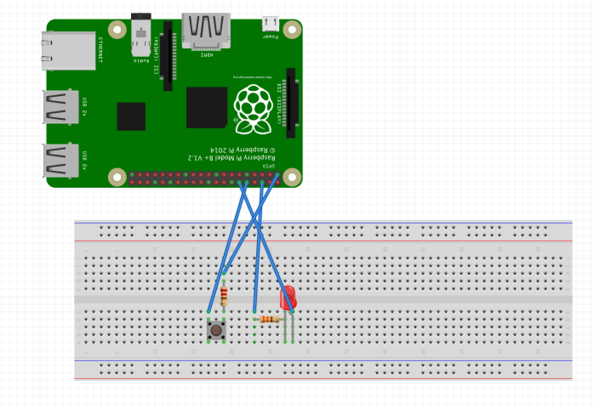

# 20_fruit_sums

## Project Structure
- src: contains the code that runs on the Raspberry Pi
- assets: contains the fritzing diagrams for this project

## Download and Use Instructions
- Main libraries, packages, and APIs used for this project:
	- Google Vision API
	- OpenCV
	- Twilio
	- PiCamera
- Dependencies may be installed using the `requirements.txt` file. 
	- Create a virtualenv and download all dependencies using the command `pip install -r requirements.txt`
- Configure a Google Cloud account for this project. Resources to help with setting up the Vision API can be found [here](https://cloud.google.com/vision/docs/setup).
- Configure a Twilio account and phone number for this project. Set up instructions can be found [here](https://www.twilio.com/docs/usage/tutorials/how-to-use-your-free-trial-account). 
- Once the modules have been downloaded, run the `fruit_sums_with_motion.py` file to start. 

## Wiring Diagram
- 